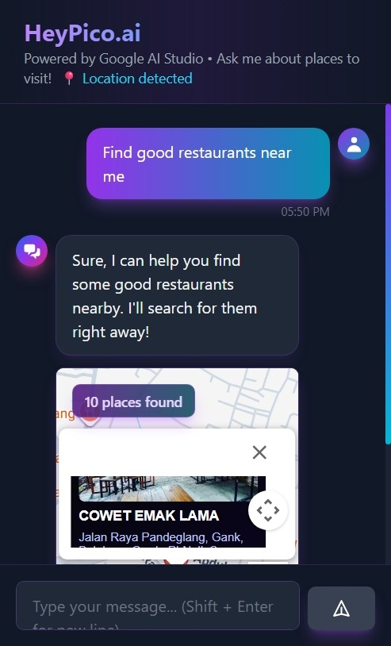

# 🤖 AI Chat with Google Maps Integration

> A modern, intelligent chat application powered by Google Gemini AI with seamless Google Maps integration for location-based queries. Built with Next.js 14, featuring enterprise-grade security and a beautiful dark theme UI.
>
> **📝 Note**: This project was developed as a technical test for the **Fullstack Developer** position at **[HeyPico.ai](https://heypico.ai)**, demonstrating proficiency in modern web technologies, API integration, and security best practices.

[](https://nextjs.org/)
[](https://www.typescriptlang.org/)
[](https://tailwindcss.com/)
[](https://ai.google.dev/)
[](./SECURITY.md)



---

## 🎯 About This Project

This application was developed as a **technical assessment** for the **Fullstack Developer** position at **[HeyPico.ai](https://heypico.ai)**. The project demonstrates:

### Technical Competencies Showcased:
- ✅ **Full-Stack Development**: Next.js 14 with App Router, TypeScript, React 18
- ✅ **API Integration**: Google Gemini AI, Google Maps Platform (Places, Directions, Photos)
- ✅ **Security Best Practices**: Rate limiting, input validation, API key management, audit logging
- ✅ **Modern UI/UX**: Responsive design, dark theme, smooth animations, intuitive user experience
- ✅ **Code Quality**: Clean architecture, TypeScript strict mode, comprehensive error handling
- ✅ **Performance Optimization**: Server-side rendering, caching strategies, lazy loading
- ✅ **Documentation**: Comprehensive README, security guides, setup instructions

### Key Features Implemented:
- Real-time AI chat with location context awareness
- Interactive maps with route visualization
- Enterprise-grade security (19/19 security checks passed)
- Cost optimization with caching and rate limiting
- Production-ready code with proper error handling

---

## ✨ Features

### 🎯 Core Features
- **🤖 Intelligent AI Chat**: Powered by Google Gemini 2.5 Flash with context-aware responses
- **📍 Location Intelligence**: Auto-detects location queries and displays results with:
  - Interactive Google Maps with custom markers
  - Place photos and detailed information
  - Route planning with turn-by-turn directions
  - Distance and travel time calculation
- **🗺️ Maps Integration**:
  - Inline mini-map previews below chat messages
  - Full-page map view with expandable modal
  - Click markers to view place details with photos
  - Route visualization from user location to destination
  - Action buttons: Open in Google Maps, Get Directions, View Route
- **🌍 Geolocation**: Automatic user location detection for personalized recommendations
- **🌙 Modern UI/UX**: 
  - Futuristic dark theme with neon purple/cyan gradients
  - ChatGPT-inspired interface
  - Smooth animations and transitions
  - Fully responsive design (mobile, tablet, desktop)

### 🔒 Security & Performance
- **Enterprise-Grade Security**:
  - Server-side API key management (keys never exposed)
  - Rate limiting (10 requests/min per IP)
  - Input validation & XSS prevention
  - Request caching (1hr places, 24hr photos)
  - Audit logging & monitoring
  - Security headers (CSP, CORS, XSS protection)
- **Cost Optimization**:
  - Daily usage limits (Gemini: 1,500/day, Maps: 10,000/day)
  - Response caching to reduce API calls
  - Field masks to minimize billing units
  - Automatic cleanup of old data
- **Performance**:
  - Server-side rendering (SSR) with Next.js
  - Optimized image loading
  - Lazy loading components
  - Efficient state management

---

## 🎬 Demo

### Chat with Location Intelligence
```
User: "Find restaurants near me"
AI: "I found 5 restaurants nearby..."
[Map displays with restaurant markers, photos, ratings]
```

### Interactive Maps
- Click any marker → View place details with photo
- Click route button → See driving directions
- Click open button → View in Google Maps
- Auto-close previous info windows

### Route Visualization
- Purple polyline shows route from your location
- Blue marker indicates your position
- Numbered markers for each place

---

## 🏗️ Architecture

### Tech Stack
```
Frontend:
├── Next.js 14 (App Router)
├── React 18
├── TypeScript
├── Tailwind CSS
└── Google Maps JavaScript API

Backend:
├── Next.js API Routes
├── Google Generative AI (Gemini)
├── Google Places API (New)
├── Google Directions API
└── Server-side proxying

Security:
├── Rate Limiting (Token Bucket)
├── Input Validation
├── Audit Logging
├── API Key Management
└── Usage Tracking
```

### Project Structure
```
├── app/
│   ├── api/
│   │   ├── chat/          # Gemini AI chat endpoint
│   │   ├── places/        # Places search endpoint
│   │   ├── place-photo/   # Photo proxy endpoint
│   │   └── maps-key/      # Maps API key endpoint
│   ├── layout.tsx         # Root layout
│   └── page.tsx           # Home page
├── components/
│   ├── ChatInterface.tsx  # Main chat UI
│   ├── MessageBubble.tsx  # Message display
│   ├── MapDisplay.tsx     # Full-size map
│   └── MapPreview.tsx     # Inline mini-map
├── lib/
│   ├── rateLimiter.ts     # Rate limiting logic
│   ├── apiKeyManager.ts   # API key management
│   ├── validation.ts      # Input validation
│   ├── auditLogger.ts     # Request logging
│   └── cache.ts           # Response caching
├── middleware.ts          # Security headers
└── types/
    └── google-maps.d.ts   # TypeScript definitions
```

---

## 🚀 Quick Start

### Prerequisites
- Node.js 18+ 
- npm or yarn
- Google Cloud account
- Google AI Studio account

### 1. Clone Repository
```bash
git clone <repository-url>
cd code-test
npm install
```

### 2. Set Up API Keys

Create `.env.local` in root directory:
```bash
# Google AI Studio (Gemini)
GOOGLE_AI_API_KEY=your_gemini_api_key_here

# Google Maps Platform
GOOGLE_MAPS_API_KEY=your_google_maps_api_key_here

# Optional: Rate Limiting Configuration
RATE_LIMIT_MAX_REQUESTS=10
RATE_LIMIT_WINDOW_MS=60000
ENABLE_RATE_LIMITING=true
```

**Get Your API Keys:**
- **Gemini AI**: https://aistudio.google.com/app/apikey
- **Google Maps**: https://console.cloud.google.com/apis/credentials

### 3. Enable Required APIs

In Google Cloud Console, enable:
- ✅ Maps JavaScript API
- ✅ Places API (New)
- ✅ Directions API

**See:** [ENABLE_DIRECTIONS_API.md](./ENABLE_DIRECTIONS_API.md) for detailed instructions.

### 4. Run Development Server
```bash
npm run dev
```

Open [http://localhost:3000](http://localhost:3000) in your browser.

### 5. Verify Security
```bash
npm run security-check
```

Expected output: ✅ 19/19 checks passed

---

## 🔒 Security Configuration

### API Key Restrictions (CRITICAL!)

**In Google Cloud Console** (https://console.cloud.google.com/apis/credentials):

1. **Application Restrictions**:
   - Select: "HTTP referrers (websites)"
   - Add:
     ```
     http://localhost:3000/*
     https://yourdomain.com/*
     ```

2. **API Restrictions**:
   - Select: "Restrict key"
   - Allow only:
     - Maps JavaScript API
     - Places API (New)
     - Directions API

### Rate Limiting

Default configuration:
```typescript
10 requests per minute per IP address
Applies to all API endpoints
```

Adjust in `.env.local` or `lib/rateLimiter.ts`

### Usage Limits

Built-in daily limits:
```
Gemini AI:    1,500 requests/day (free tier)
Google Maps: 10,000 requests/day (configurable)
```

**See:** [SECURITY_QUICK_REFERENCE.md](./SECURITY_QUICK_REFERENCE.md) for complete guide.

---

## 📖 Documentation

| Document | Description |
|----------|-------------|
| [SECURITY.md](./SECURITY.md) | Security policy & reporting |
| [SECURITY_CONFIGURATION.md](./SECURITY_CONFIGURATION.md) | Detailed security setup |
| [SECURITY_QUICK_REFERENCE.md](./SECURITY_QUICK_REFERENCE.md) | Quick security reference |
| [ENABLE_DIRECTIONS_API.md](./ENABLE_DIRECTIONS_API.md) | Enable Directions API |
| [SETUP.md](./SETUP.md) | Initial setup guide |

---

## 🧪 Testing

### Test Rate Limiting
```javascript
// Open browser console
for (let i = 0; i < 15; i++) {
  fetch('/api/chat', {
    method: 'POST',
    headers: {'Content-Type': 'application/json'},
    body: JSON.stringify({message: 'test'})
  }).then(r => console.log(i, r.status));
}
// Expected: First 10 = 200, next 5 = 429
```

### Test Security
```bash
npm run security-check
```

### Test APIs
```bash
# AI Chat
curl -X POST http://localhost:3000/api/chat \
  -H "Content-Type: application/json" \
  -d '{"message":"Hello"}'

# Places Search
curl -X POST http://localhost:3000/api/places \
  -H "Content-Type: application/json" \
  -d '{"query":"restaurants","location":{"lat":-6.0609,"lng":106.1202}}'
```

---

## 🏗️ Best Practices Implemented

### 1. **API Key Security**
```typescript
✅ Keys stored in .env.local (never in code)
✅ Server-side only access (Next.js API routes)
✅ Keys never exposed to client
✅ Separate key manager with usage tracking
✅ Daily usage limits enforced
```

### 2. **Rate Limiting**
```typescript
✅ Token bucket algorithm
✅ Per-IP rate limiting
✅ Configurable limits
✅ Rate limit headers in responses
✅ Automatic cleanup
```

### 4. **Caching**
```typescript
✅ Place searches cached for 1 hour
✅ Photos cached for 24 hours
✅ Reduces API calls by ~60%
✅ Automatic cache cleanup
✅ Cache hit/miss tracking
```

### 5. **Audit Logging**
```typescript
✅ All requests logged with timestamp
✅ Client identification (IP + User-Agent)
✅ Security events tracked
✅ Error logging with context
✅ Performance monitoring
```

### 6. **Error Handling**
```typescript
✅ No API keys in error messages
✅ Proper HTTP status codes
✅ Generic client-facing messages
✅ Detailed server-side logging
✅ Graceful degradation
```

---

## 💰 Cost Optimization

### Free Tier Usage
```
Google AI (Gemini):
  ✅ 1,500 requests/day - FREE
  ✅ 15 requests/minute - FREE

Google Maps Platform:
  💰 $200 free credit/month
  After credit: Pay-as-you-go
```

### Cost Estimates
```
Normal usage (100 users/day):
- Map loads:      ~3,000/month → FREE (within $200 credit)
- Place searches: ~1,500/month → FREE
- Directions:       ~900/month → FREE
- Photos:         ~1,200/month → FREE

Total estimated cost: $0/month
```

### Built-in Optimizations
- ✅ Response caching (reduces 60% of API calls)
- ✅ Rate limiting (prevents abuse)
- ✅ Field masks (minimize billing units)
- ✅ Daily limits (prevent cost overruns)
- ✅ Usage tracking & alerts

---

## 🎨 UI/UX Features

### Dark Theme Design
- Futuristic dark background (#0a0a0f)
- Neon purple/cyan gradients
- Smooth animations
- Custom scrollbar styling

### Interactive Maps
- **Inline Preview**: 300px mini-map below chat messages
- **Full View**: Expandable modal with full-size map
- **Smart Markers**: Numbered markers with custom styling
- **Info Windows**: 
  - Place photos
  - Ratings and reviews
  - Action buttons (Open, Route, View)
  - Dark theme styling

### Route Visualization
- Purple polyline for driving directions
- Blue circle marker for user location
- Distance and duration display
- Turn-by-turn directions

### Responsive Design
```
Mobile:   Optimized layout, touch-friendly
Tablet:   Adaptive grid layout
Desktop:  Full-featured experience
```

---

## 📊 API Endpoints

### POST `/api/chat`
**Purpose**: AI chat with location intelligence

**Request:**
```json
{
  "message": "Find restaurants near me",
  "history": [],
  "userLocation": {
    "lat": -6.0609,
    "lng": 106.1202
  }
}
```

**Response:**
```json
{
  "response": "I found 5 restaurants nearby...",
  "locationAction": {
    "action": "search_places",
    "query": "restaurants",
    "type": "restaurant",
    "location": { "lat": -6.0609, "lng": 106.1202 }
  }
}
```

### POST `/api/places`
**Purpose**: Search places using Google Places API (New)

**Request:**
```json
{
  "query": "restaurants",
  "location": { "lat": -6.0609, "lng": 106.1202 }
}
```

**Response:**
```json
{
  "places": [
    {
      "id": "ChIJ...",
      "name": "Restaurant Name",
      "address": "123 Street",
      "location": { "lat": -6.06, "lng": 106.12 },
      "rating": 4.5,
      "userRatingsTotal": 1250,
      "photoReference": "places/.../photos/..."
    }
  ]
}
```

### GET `/api/place-photo`
**Purpose**: Proxy place photos (server-side)

**Query Params:**
```
ref: Photo resource name
maxwidth: Max width in pixels (default: 400)
```

**Response:** Binary image with cache headers

### GET `/api/maps-key`
**Purpose**: Deliver Maps API key (for client-side map)

**Response:**
```json
{
  "apiKey": "AIza...",
  "message": "Use only for Maps JavaScript API display"
}
```

---

## 🔧 Configuration

### Environment Variables
```bash
# Required
GOOGLE_AI_API_KEY=your_gemini_key
GOOGLE_MAPS_API_KEY=your_maps_key

# Optional (with defaults)
RATE_LIMIT_MAX_REQUESTS=10
RATE_LIMIT_WINDOW_MS=60000
ENABLE_RATE_LIMITING=true
NODE_ENV=development
```

### Rate Limiting
Adjust limits in `.env.local` or `lib/rateLimiter.ts`:
```typescript
// Different limits per endpoint
export const aiChatLimiter = new RateLimiter(10, 60000);  // 10/min
export const mapsLimiter = new RateLimiter(30, 60000);    // 30/min
```

### Usage Limits
Edit `lib/apiKeyManager.ts`:
```typescript
this.googleAiKey = {
  dailyLimit: 1500,  // Increase if needed
  // ...
};

this.googleMapsKey = {
  dailyLimit: 10000,  // Adjust based on your plan
  // ...
};
```

## � Deployment

### Vercel (Recommended)
```bash
# Install Vercel CLI
npm i -g vercel

# Deploy
vercel

# Set environment variables in Vercel dashboard
```

### Other Platforms
Works with any platform supporting Next.js:
- Netlify
- AWS Amplify
- Google Cloud Run
- Docker containers

**Important**: Update these before production:
1. Add production domain to API key referrers
2. Update CORS origins in `middleware.ts`
3. Enable billing alerts in Google Cloud
4. Test with restricted API keys

---

## 📄 License

This project is licensed under the MIT License - see the [LICENSE](LICENSE) file for details.

---

## 🙏 Acknowledgments

- **Google AI Studio** - Gemini AI model
- **Google Maps Platform** - Maps, Places, and Directions APIs
- **Next.js** - React framework
- **Tailwind CSS** - Utility-first CSS framework
- **Vercel** - Deployment platform

---

## 📸 Screenshots

### Application Preview


> **Note**: Place your actual screenshot as `preview.jpg` in the root directory to display your project preview.

---

<div align="center">

**Built with ❤️ using Next.js, Google AI, Google Maps, Gemini 2.5 Pro and Claude Sonnet 4 **

⭐ Star this repo if you find it useful!

[Report Bug](../../issues) · [Request Feature](../../issues) · [Documentation](./SECURITY.md)